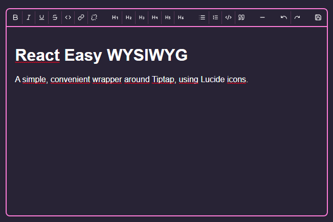

# React Easy WYSIWYG

A simple, convenient frontend for [tiptap](https://tiptap.dev/), which itself builts upon [ProseMirror](https://prosemirror.net/). Outputs HTML or JSON.

Icons from [Lucide icons](https://lucide.dev/).



Implemented modules are:

- The entire TipTap Starterkit
- Link
- Underline

## Why?

Tiptap, by design, only provides the barebones tools to built a text editor. For my personal website I built a wrapper, and decided I might as well release it for others to use.

## Demo

To view the demo, clone the repo, run `npm i` to install dependencies and then run `npm run demo`.

## Usage

> This package is ESM only, and is built targetting ES2019.

`npm install react-easy-wysiwyg`

```jsx
import Editor from "react-easy-wysiwyg";

// Assuming you can import CSS directly, like with Vite, CRA or Next.js
import "react-easy-wysiwyg/styles.css";

const App = () => {

  return (<>
    <h1>My wonderful app</h1>
    <Editor />
  </>)
}
```

### Next.js

Due to the inherently large size of this module, it's highly recommended to lazy load the module in your page, with [`next/dynamic`](https://nextjs.org/docs/advanced-features/dynamic-import) for example.

If using the `app` directory, available in Next.js 13, you'll need to [mark it's parent as a Client Component](https://beta.nextjs.org/docs/rendering/server-and-client-components#convention).

## API

| Prop            | Type                       | Default                   | Description                                                                                                                                                                         |
| --------------- | -------------------------- | ------------------------- | ----------------------------------------------------------------------------------------------------------------------------------------------------------------------------------- |
| `content`       | `object` \| `string`       |                           | The content, either a JSON object as exported by tiptap, or an HTML document                                                                                                        |
| `onSave`        | `(string \| object) => {}` |                           | On save, this function receives one argument, the `content`. This is either HTML (string) or an object, based on the `exportHTML` prop                                              |
| `exportHTML`    | `boolean`                  | `false`                   | If set to true, onSave receives an HTML string instead of an object                                                                                                                 |
| `editable`      | `boolean`                  | `true`                    | If set to false, the editor will render `content` without editing capabilities. It will still import all moduled needed for editing, however, so a dedicated solution is preferred. |
| `showWordCount` | `boolean`                  | `true`                    | Whether or not to show the wordcount in the lower right corner                                                                                                                      |
| `className`     | `string`                   |                           | Allows passing a custom className to the wrapper (which already has the `rew-wrapper` class, as well as some default styling)                                                       |
| `buttons`       | `object`                   | [`buttons {}` ](#buttons) | Allows customizing displayed buttons. See [buttons](#buttons)                                                                                                                       |
| `labels`        | `object`                   | [`labels {}`](#labels)    | Allows changing displayed text. See [labels](#labels)                                                                                                                               |
| `onLinkClick`   | `(e) => {}`                | See description           | By default, ignores clicked links, unless `cmd` or `ctrl` is pressed.                                                                                                               |

### `labels`

```js
{
  url: "URL",
  save: "Save",
}
```

### Customizing

There are several options to customize the look of the Editor. For larger changes, you're better off building an interface for tiptap yourself.

#### Styles

This is the easiest, and the one you'll probably always want. It can be as simple as redefining CSS Custom properties.

```css
.rew-container {
  /* Styling defaults */
  --rew-background-color: #282336;
  --rew-color: #fff;

  /* Styling inline code */
  --rew-inline-code-background-color: #000;
  --rew-inline-code-color: #cfcfcf;
  --rew-inline-code-font: monospace;

  /* Styling code blocks */
  --rew-code-background-color: #000;
  --rew-code-color: #cfcfcf;
  --rew-code-font: monospace;

  /* Styling the borders */
  --rew-accent: #ff7edb;
  /* Color of menu seperators */
  --rew-seperator: rgba(255,126,219,.2);
  /* Color of indicators for quote blocks */
  --rew-highlight: rgba(255,126,219,.2);
  /* Background color of 'active' buttons */
  --rew-selected: rgba(255,126,219,.2)
}

@media (prefers-color-scheme: dark) {
  .rew-container {
    /* Same, but for dark mode users */
  }
}
```

The module is built using [CSS Modules](https://github.com/css-modules/css-modules), so naming collissions are unlikely. Several 'plain' namespaced classNames are exposed for further styling:

```css
.rew-container {
  /* The outermost <div>, containing both the menu and the wrapper */
}
.rew-menu {
  /* The menu bar at the top, containing all buttons */
}
.rew-wrapper {
  /* The <div> wrapping the content-editable <div> rendered by tiptap */
}
```

On top of this, the `.ProseMirror` class can be used for styling the content itself. By default, your 'normal' styles are inherited.

#### Buttons

This module allows for custom buttons if you don't like the look of the default icons from [Lucide icons](https://lucide.dev/). To do so, just provide a buttons prop to the editor:

```jsx
// All possible options. You only have to provide the ones you want to override.
const altButtons = {
  bold: "B",
  italic: "I",
  underline: "U",
  strikethrough: "S",
  heading1: "H1",
  heading2: "H2",
  heading3: "H3",
  heading4: "H4",
  heading5: "H5",
  heading6: "H6",
  code: "C",
  bulletList: "L",
  orderedList: "LO",
  codeBlock: "CB",
  blockquote: "BQ",
  horizontalRule: "M",
  undo: "U",
  redo: "R",
  link: "L",
  unlink: "UL",
  save: "Sa",
};

<Editor buttons={altButtons} />
```

If any alt is not defined, the default icon will render. To disable, just set it to any falsy value like `false` or `null`.

The content can be any _node_ that react can render (which is basically anything). No logic for rendering is provided, so if using React components, you must pass the rendered result, not the component itself:

```jsx
const Bold = () => <span>B</span>;
const Italic = () => <span>I</span>;

<Editor buttons={{
  bold: <Bold />, // ✅
  italic: Italic, // ❌
}} />
```
